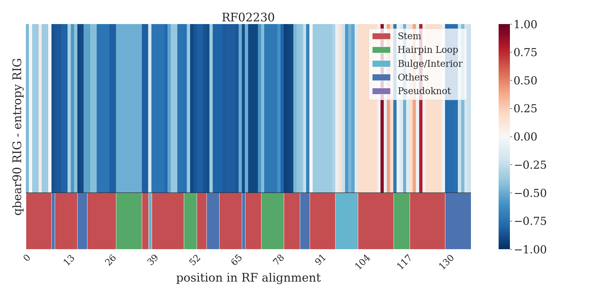

## RIG scores together with (rescaled) sequence entropy

This folder will contain the plots generated by the [plot_RIG_minus_Entropy.py](../../../scripts/plot_RIG_minus_Entropy.py) 
script.

As an example, the RIG plot (with WUSS notation) minus the (rescaled) sequence entropy of the RF02230 Rfam family is
reported. The RIG scores are calculated using RNA Blocks obtained by removing redundant primary sequences up to 90% of
similarity. The sequence entropy is rescaled in a way similar to RIG in order to compare them in a more intuitive way.

In the lower part there is a colour mapping representing the consensus structure of the family. In this case the stem 
towards the 3’ end is more conserved in structure than it is in sequence throughout the family members. 