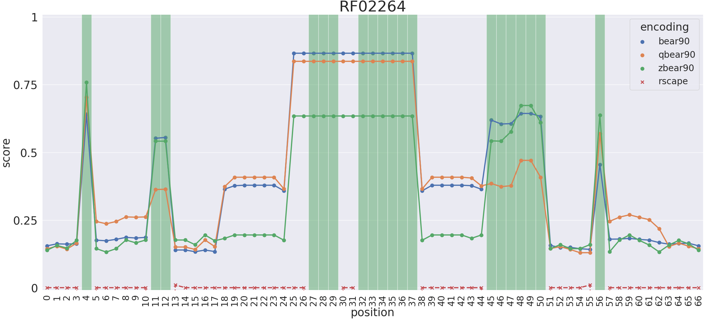

## RIG scores together with R-scape power values

This folder will contain the plots generated by the [plot_RIG_and_RscapePower.py](../../../scripts/plot_RIG_and_RscapePower.py) 
script.

As an example, the RIG plot together with R-scape power values of the RF02264 Rfam family is reported. The RIG scores are 
calculated using RNA Blocks obtained by removing redundant primary sequences up to 90% of similarity.

Green bands represent areas where R-scape has no value (unpaired elements). High RIG values represent structural conservation, 
independently from base-pair covariation.