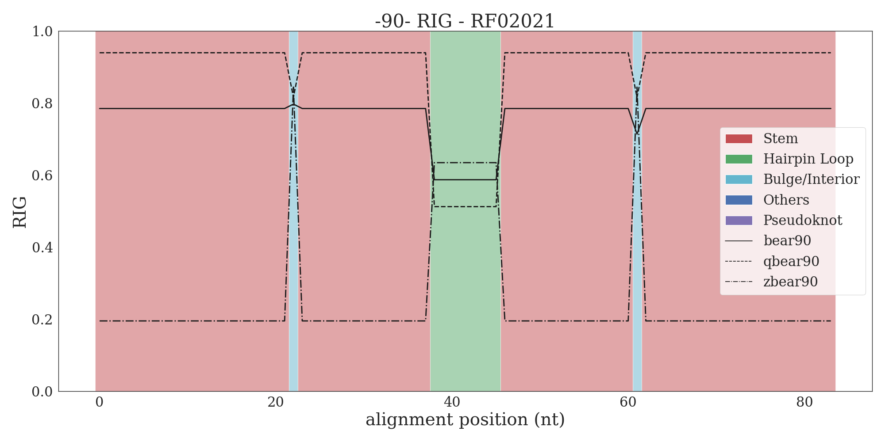

## RIG plots with WUSS notation from secondary structure consensus

This folder will contain the plots generated by the [plot_RIG_with_WUSS_notation.py](../../scripts/plot_RIG_with_WUSS_notation.py) 
script.

As an example, the RIG plot with WUSS notation of the RF02021 Rfam family is reported. The RIG scores are calculated using 
RNA Blocks obtained by removing redundant primary sequences up to 90% of similarity.

The color on the background represent the structural elements from the structural consensus reported in the covariance model 
and is reported for ease of interpretation. The less conserved hairpin loop is showed as a depression in the RIG plot for 
bear and qbear. This should be interpreted as a conservation in the structural context (hairpin loop, high values for zbear), 
where the individual RNAs have different hairpin loop lengths.