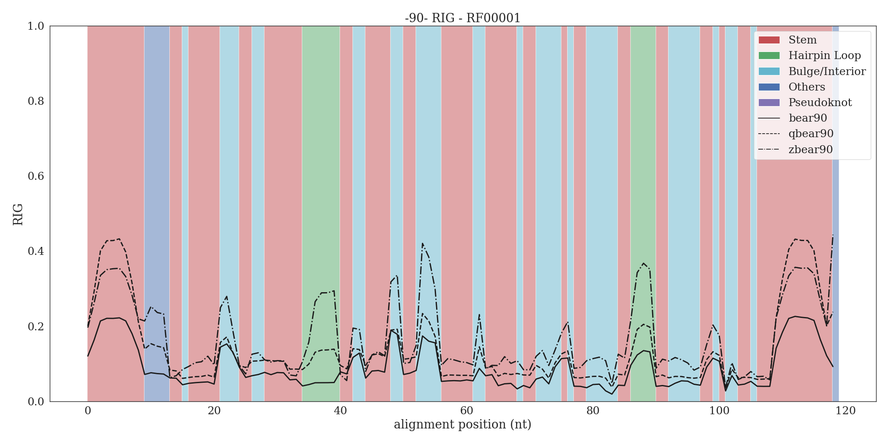

## RIG plots with WUSS notation from secondary structure consensus.

This directory will contains the plots generated by the [plot_RIG_with_WUSS_notation.py](../../scripts/plot_RIG_with_WUSS_notation.py) 
script.

As an example, the RIG plot with WUSS notation of the RF00001 Rfam family is reported.

The RIG scores are calculated using RNA Blocks obtained by removing redundant primary sequences up to 90% of similarity. 
Background colors are mapped to secondary structure elements of the consensus structure provided by the covariance model.
